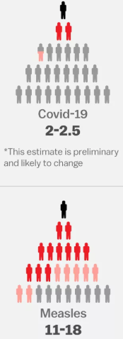
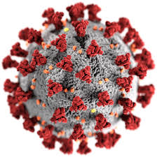
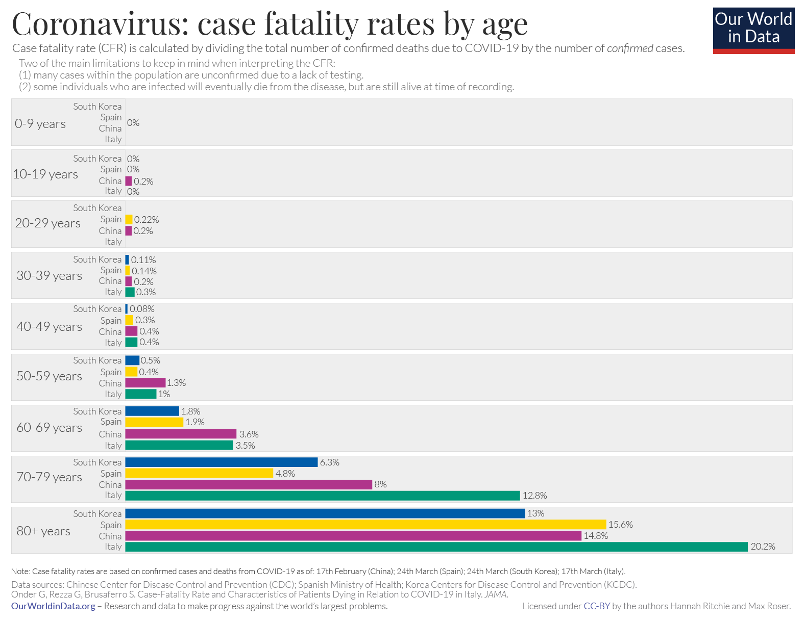

```{r setup, include=FALSE}
options(htmltools.dir.version = FALSE)
```

```{r xaringan-themer, include=FALSE}
library(xaringan)
library(xaringanthemer)

duo_accent(
  primary_color = "#23395b",
  secondary_color = "#37a0cb",
  background_color = "#FFFFFF",
  header_font_google = google_font("Montserrat"),
  text_font_google   = google_font("Montserrat", "300", "300i"),
  code_font_google   = google_font("Ramabhadra")
)
```

 # Epidemics are not new to human history
- **1348-1351** **Bubonic plague** (Second plague pandemic, or "Black death")
    - Bacterium _Yersinia pestis_
    - Estimated 25-75 million deaths in Europe and Asia
    - Reduced 30% to 60% of Europe's population ([Austin Alchon, 2003](https://books.google.dk/books?id=YiHHnV08ebkC&pg=PA21&redir_esc=y#v=onepage&q&f=false))
    - No treatment
    
.footnote[_"The trend of recent research is pointing to **45–50% of the European population dying during a four-year period***. There is a fair amount of geographic variation. In Mediterranean Europe, areas such as **Italy, the south of France and Spain**, where plague ran for about four years consecutively, it was probably closer to **75–80% of the population**. In **Germany and England** it was probably closer to **20%**"_ (Philip Daileader, The Late Middle Ages, 2007)]
---
- **1918-1919** 1st pandemic caused by **H1N1 influenza virus** ("Spanish flu")
    - Basic reproductive number (R0): 1.5 (1.2–3.0)([Vynnycky, 2007](https://academic.oup.com/ije/article/36/4/881/667165))
    - ~ 500 million estimated infected (33% of the world's population) ([Taubenberger, 2006](https://www.ncbi.nlm.nih.gov/pmc/articles/PMC3291398/))
    - 17 to 20 million deaths globally
    - Severe disease with case-fatality rate >2.5%
    - No treatment
    - No prevention (no vaccine)
--

- **2002-2004** **SARS** (SARS-CoV virus)
    - Basic reproductive number (R0): 2.0-4.0 ([WHO, 2003](https://www.who.int/csr/sars/en/WHOconsensus.pdf))
    - 8096 cases
    - ~774 deaths in 32 countries **→** case fatality rate 9.6% ([WHO, 2004](https://www.who.int/csr/sars/country/table2004_04_21/en/))
    - Vaccine inducing neutrolizing antibodies ([Chien-Te Tseng, 2012](https://www.ncbi.nlm.nih.gov/pmc/articles/PMC3335060/))

--

- **2009** 2nd pandemic caused by **H1N1 influenza virus** (H1N1/09, or "Swine flue")
    - Basic reproductive number (R0): 1.5 (1.3–1.7)
    -	~ 0.7–1.4 billion estimated infected worldwide
    -	~ 151,700–575,400 estimated deaths worldwide
    -	Vaccine available
    
---

- **2012-present** **MERS** (MERS-CoV)
    - Basic reproductive number (R0) <1 ([WHO, 2019](https://apps.who.int/iris/bitstream/handle/10665/326126/WHO-MERS-RA-19.1-eng.pdf?ua=1))
      - Heterogenous R0: 1.0-5.7 at the start of the outbreak → < 1.0 [Bernard-Stoecklin, 2019](https://www.nature.com/articles/s41598-019-43586-9)
    - 2012-2016: 1841 laboratory confirmed cases → 80% in the Kingdom of Saudi Arabia
    -	~ 35% (n=652) died
--

-	**2014-2016 Ebola**
    -	Basic reproductive number (R0): 1.7-2.0 ([WHO Ebola Response Team, 2016](https://www.who.int/ebola/publications/nejm-after-ebola.pdf) )
    - ~ 28,542 cases
    -	~ 11,299 deaths
    -	CFR ~ 40%

---

 # Emerging Infectious Diseases
**Identification of infectious agents and diseases that were not recognized before**

**Infection states**

- Progression-Related

State of Infection | Definition| Alternative Terms
 --------|---------|---------
Colonization | Transient colonization tissue invasion | Transient colonization
Infection | Agent is present in host tissues without signs, symptoms, or laboratory evidence of tissue damage | Subclinical infection, asymptomatic infection
Latency | Infection in which the agent has invaded the host and is in a nonreplicating, noninfectious, but viable state | Latent infection, persistent infection, chronic infection
Disease | Agent is replicating in host tissues with signs, symptoms, or laboratory evidence of tissue damage | Clinical disease, symptomatic infection
Cure | Agent has been eliminated from host tissue (may persist on surface) | Resolution

---
**Infection states**

- Transmission-Related

State of Infection | Definition| Alternative Terms
 --------|---------|---------
Preinfectious | Host is infected but has not become infectious | Latency, preinfective period
Infectious | Host is capable of transmitting agent to others | Contagiousness, infective period
Postinfectious | Host is no longer capable of transmission | Cure, postinfective period

.footnote[Rothman KJ, Modern Epidemiology, 3rd Edition]

---
# Modeling infectious diseases
- Agent-based models
- Multi-level models
- Network models
- Compartmental models
    - SIR (Susceptible → Infectious → Recovered)
    - SEIR (Susceptible → Exposed → Infectious → Recovered)
    - SEIS (Susceptible → Exposed → Infectious → Susceptible)
    - Other modifications to accomodate duration of post-infection immunity, vaccination, etc.

---
# Key definitions
- Attack rate
  - The proportion of the population which contracts the disease fro the population at risk


- Case-fatality risk (CFR)
  - The probability that a person dies from an infection given that they are a case


- Infection-fatality risk (IFR)
  - Defines a case as a person who has shown evidence of infection, either by clinical detection of the pathogen or by seroconversion or other immune response

.footnote[[Lipsitch, 2015](https://journals.plos.org/plosntds/article?id=10.1371/journal.pntd.0003846)]

---
# Basic Reproductive Number
.pull-left[
- **R0** (often pronounced _"R naught"_)
  - The **average number of secondary cases** of an infection that occur **in a completely
susceptible population following a single infectious case**
  
  _How many other people one contagious individual will infect in non-immune population?_
  
  - Mathematical modeling of transmission within populations
  ]

.right[

]

.footnote[
[Vox, 2020](https://www.vox.com/science-and-health/2020/4/2/21197617/coronavirus-pandemic-covid-19-death-rate-transmission-risk-factors-lockdowns-social-distancing)

[NEJM, 2020](https://www.nejm.org/doi/full/10.1056/NEJMoa2001316)]

---

# Coronavirus disease (COVID-19) outbreak

- **SARS-CoV-2**
- β-coronavirus (other two known β-CoVs are SARS-CoV and MERS-CoV)
- Origin:  bats via unknown intermediate hosts to infect humans
- Uses angiotensin-converting enzyme 2 (ACE2), the same receptor as SARS-CoV, to infect humans
- Incubation period
    - Median 5.1 days (95% CI, 4.5 to 5.8 days), and 97.5% of those who develop symptoms will do so within 11.5 days ([mainland China data](https://www.ncbi.nlm.nih.gov/pmc/articles/PMC7081172))
    - China CDC: 10-14 days
    - USA CDC: [2-14 days](https://www.cdc.gov/coronavirus/2019-ncov/about/symptoms.html)
- Period of infectivity: 90% negative viral RNA tests on nasopharyngeal swabs by 10 days after the onset of symptoms ([Liu, 2020](https://www.thelancet.com/action/showPdf?pii=S1473-3099%2820%2930232-2))
- Immunity: preliminary data for neutralizing antibodies ([Kai-Wang To, 2020](https://www.thelancet.com/action/showPdf?pii=S1473-3099%2820%2930196-1); [Ju, 2020](https://www.biorxiv.org/content/10.1101/2020.03.21.990770v1.full.pdf))

.right[]

---
# Testing for COVID-19
- Different testing patterns/kits in different countries

- Probability of being tested is not independent of disease severity and of the outcome

- RT-PCR:
    - Tests are not perfect
      - Analytical Sensitivity 95%
      - Positive (COVID-19_N_P) – positive for all targets detected (Ct < 40)
      - [Analytical Specificity: no cross-reactivity](https://www.fda.gov/media/136151/download)
      
- No reliable data on comparative accuracy of oropharyngeal vs nasopharyngeal swabs for diagnosis of [COVID-19](https://www.cebm.net/covid-19/comparative-accuracy-of-oropharyngeal-and-nasopharyngeal-swabs-for-diagnosis-of-covid-19/)

---
**Total number of tests for COVID-19**
<iframe src="https://ourworldindata.org/grapher/full-list-total-tests-for-covid-19" style="width: 100%; height: 550px; border: 0px none;"></iframe>

---
** Tests per 1 million population**
<iframe src="https://ourworldindata.org/grapher/full-list-cumulative-total-tests-per-million" style="width: 100%; height: 550px; border: 0px none;"></iframe>

---
**Number of registrered/confirmed COVID-19 cases**

<iframe src="https://ourworldindata.org/grapher/covid-confirmed-cases-since-100th-case" style="width: 100%; height: 550px; border: 0px none;"></iframe>

---
**Number of registered/confirmed COVID-19 cases and case-fatality rates**

<iframe src="https://ourworldindata.org/grapher/covid-19-total-confirmed-cases-vs-total-confirmed-deaths?time=0..76" style="width: 100%; height: 550px; border: 0px none;"></iframe>

---
**Case-fatality rates among registrered/confirmed COVID-19 cases**

<iframe src="https://ourworldindata.org/grapher/coronavirus-cfr?year=17&time=-2..76" style="width: 100%; height: 550px; border: 0px none;"></iframe>
 
---

---
**Beware of bias when calculating case-fatality rate**
- The data we use to estimate the CFR are often gathered for other purposes

- Challenging & constantly changing circumstances

- Preferential testing and counting of severe cases → overestimation

- At any point during ongoing epidemic we haven't yet observed disease outcomes for everyone → underestimation

- Delayed reporting: outcomes observed now are reported later

- Forward contact tracing → pre-symptomatic individuals → less prone to bias CFR estimates

- Comparison of CFR across groups
  - E.g., hospitalized vs non-hospitalized → multiple competing biases
      - Suvivorship
      - Selection
      - Confounding

.footnote[[Lipsitch, 2015](https://journals.plos.org/plosntds/article?id=10.1371/journal.pntd.0003846)]

---
# Treatment of COVID19
- Only symptomatic treatment
- Clinical trials for variety of agents (antiviral and other)
- Possibility of low-quality publications
---
# Chloroquine + azytromycin study
---
# Antibody response and vaccine development

---
# What next?

---
# Thank you for attention

---
# Resources
- https://ourworldindata.org/coronavirus#
- http://www.healthdata.org/covid/faqs
- http://www.imperial.ac.uk/mrc-global-infectious-disease-analysis/covid-19/report-13-europe-npi-impact/
- https://twitter.com/mlipsitch
- https://twitter.com/CT_Bergstrom
- https://twitter.com/EpiEllie

```{r eval=FALSE, include=FALSE}
pagedown::chrome_print("U:/Documents/Main/MY PHD/Teaching/Masters_in_Molecular_Medicine/2020/COVID19 presentation/COVID19-slides.html")
```

